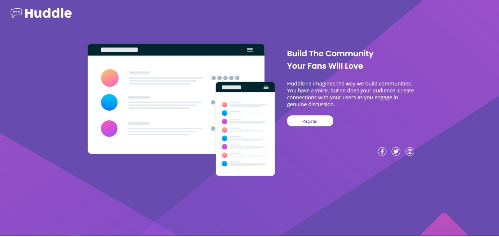

# Frontend Mentor - Huddle landing page with single introductory section

This landing page was done as practice for a fictional company called Huddle. The project was done in vanilla HTML and sass.

## [Live Preview](https://sharp-kare-d39d6e.netlify.app/)

## Screenshot

## Getting Started

## Viewing the site

- Fork or clone the repository to your local machine.
- Open the folder using any editor of your choice (vscode was used)

## Editing the site

- Edit the index.html as you see fit.
- To style you can edit the style.scss file under the app folder.
- The vscode extension Live sass compiler was used to compile the scss to css.

## Stack

- HTML
- Sass

## Author

- [Motheo Keneilwe](https://github.com/mtkrated)

## Acknowledegments

- My thanks goes to the people at [Front-End-Mentor](https://www.frontendmentor.io/solutions) for providing quality projects.
